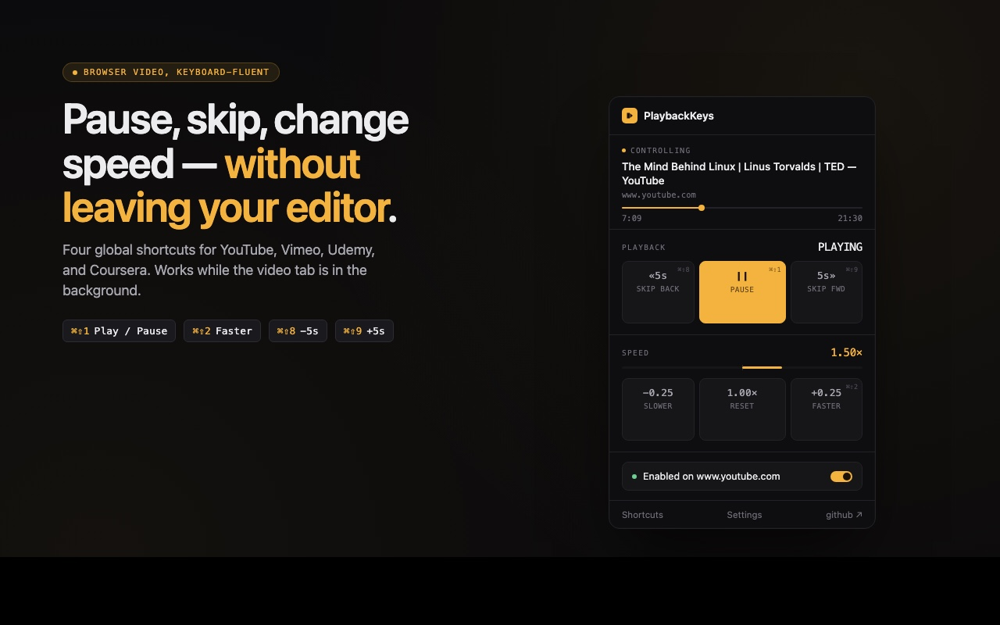

# PlaybackKeys

> **Pause less. Refocus never.** Control tutorials, lectures, and course videos with global keyboard shortcuts while you code, study, or take notes.

[](https://chromewebstore.google.com/detail/bhncnmnpinmgjpeoneoplieaakbkfdmn)

A Chrome / Edge extension for developers and students who watch tutorials or
lectures on a second monitor while typing in another app. Works on YouTube,
Vimeo, Udemy, and Coursera out of the box. You can opt in to any other site
from the extension popup.

No account. No telemetry. No network requests. Open source under MIT.



## Quick Start

1. **Visit:** [PlaybackKeys website](https://mehmetdemircs.github.io/PlaybackKeys/) for full details
2. **Install:** [Add to Chrome](https://chromewebstore.google.com/detail/bhncnmnpinmgjpeoneoplieaakbkfdmn)
2. **Open a video** on YouTube, Vimeo, Udemy, or Coursera
3. **Press `Ctrl+Shift+1`** to pause/play — even if Chrome isn't focused
4. **Customize shortcuts** at `chrome://extensions/shortcuts`

## Why

The four built-in player shortcuts on most sites only fire when the video tab
is focused. The moment you switch to your editor or notes app, you lose
control. Native hardware media keys partially work on YouTube and Spotify, but
not on Udemy or Coursera, and they cover only play/pause and seek - not speed
or fine skip intervals.

PlaybackKeys registers `chrome.commands` with `"global": true`, so the
shortcuts fire even when Chrome is minimized or another app is in focus.

## Default shortcuts

| Windows / Linux       | macOS         | Action          |
|-----------------------|---------------|-----------------|
| `Ctrl + Shift + 1`    | `⌘ ⇧ 1`       | Play / Pause    |
| `Ctrl + Shift + 2`    | `⌘ ⇧ 2`       | Speed +0.25x    |
| `Ctrl + Shift + 3`    | `⌘ ⇧ 8`       | Skip back 5s    |
| `Ctrl + Shift + 4`    | `⌘ ⇧ 9`       | Skip forward 5s |

Skip back / forward sit next to each other on both platforms. On macOS they
land on 8 and 9 because `⌘⇧3` through `⌘⇧6` are system screenshot shortcuts.

Three more commands ship without preset chords. Assign them at
[`chrome://extensions/shortcuts`](chrome://extensions/shortcuts):

- Speed -0.25x (suggested: `Ctrl + Shift + 7`)
- Reset speed to 1x (suggested: `Ctrl + Shift + 0`)
- Switch target tab (when multiple supported videos are open)

## How global mode works

Each command is registered with `"global": true`, so it fires while
Chrome is minimized or another app is in focus, on Windows, macOS,
and Linux. A few caveats from Chrome's docs:

- **ChromeOS does not support global commands.** Shortcuts only fire
  while Chrome itself is the focused window.
- The shortcut chord must be free at the OS level. If macOS, your
  window manager, or another extension already owns it, Chrome will
  silently leave the binding empty. Open
  `chrome://extensions/shortcuts` to verify and rebind.
- Chrome itself must be running. Quitting Chrome unloads the shortcuts.

To scope a command back to "only when Chrome is focused", switch its
dropdown in `chrome://extensions/shortcuts` from "Global" to "In Chrome".

## Tab targeting

When a shortcut fires, PlaybackKeys picks a target tab in this order. Every
candidate must (a) be a supported site, (b) not be disabled in settings, and
(c) actually contain a controllable `<video>` element (the extension checks
the DOM, not just the URL).

1. The active tab in the last focused window.
2. An audible tab. Ties go to the last focused window.
3. The most recently controlled tab, cached for the browser session.
4. Any other tab known to have a video.

A small toast at the bottom right of the targeted tab confirms the action and
shows which tab was hit. Use the **Switch target tab** command to cycle
between supported video tabs when more than one is open.

## Speed UI

When the playback rate is anything other than 1.0x, a small blue pill appears
in the bottom-left of the video tab showing the current speed. Click it to
reset to 1x. The popup also shows the current speed and a Reset button, and
right-clicking the toolbar icon offers a one-click "Reset speed to 1x".

## Install (development)

1. `git clone https://github.com/mehmetdemircs/PlaybackKeys`
2. Open `chrome://extensions`, turn on Developer mode.
3. Click **Load unpacked** and pick the cloned directory.
4. Open a YouTube video and try `Ctrl + Shift + 1`.

## Project structure

```
manifest.json              MV3 manifest
service-worker.js          Commands listener, tab targeting, dispatch
content/
  bridge.js                ISOLATED-world relay between SW and page
  injected.js              MAIN-world video manipulation, toast, badge
popup/                     Toolbar popup with playback controls
options/                   Settings page
onboarding/                Install-time welcome page
icons/                     Toolbar icons (placeholder, pending design)
```

## Stack

Vanilla JavaScript. No build step. No TypeScript. No framework. The whole
thing is plain HTML / CSS / JS files loaded directly by the browser.

## Privacy

PlaybackKeys collects nothing. No data leaves your device. Settings live in
`chrome.storage` and are visible only to you. Full policy:
[PRIVACY](https://mehmetdemircs.github.io/PlaybackKeys/PRIVACY)
([source](./docs/PRIVACY.md)).

The host permissions list is intentionally narrow (only the four built-in
sites). For any other site, you grant access per-origin via the popup's
**Enable on this site** button — Chrome shows its native permission prompt
for that one origin only. Power users can opt into a single bulk **Run on
all sites** toggle in settings, which requests `<all_urls>` once. Both
paths are off by default.

## What this extension does not do

- Skip ads, intros, or sponsor segments
- Bypass DRM (no Netflix, Disney+, Prime, HBO support)
- Modify the YouTube player UI, recommendations, or end screens
- Download videos
- Collect, transmit, or store anything off-device

These are deliberate scope decisions, not future roadmap items. The Chrome
Web Store Single Purpose Policy is the largest rejection cause for video
extensions, and the YouTube API Services Developer Policy explicitly
prohibits modifying the standard playback UI.

## Contributing

Issues and PRs welcome. **v1 is focused on stability for YouTube, Vimeo, Udemy, and Coursera.** Before opening a PR, please:

- Test the change on at least YouTube and one other supported site.
- Check that both popup and `chrome://extensions/shortcuts` still load
  without errors in the service worker console.
- Keep the no-build, no-dependency stack. If you think a dependency is
  warranted, open an issue first.

Found a broken site? [Report it here](https://github.com/mehmetdemircs/PlaybackKeys/issues).

## License

[MIT](./LICENSE)
